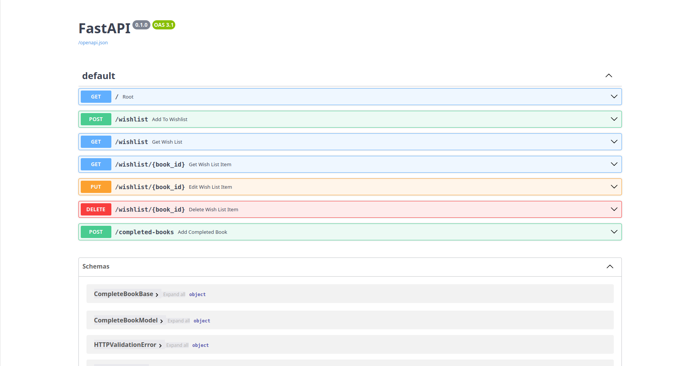

# reading_track
Keep track of books you've read and would like to 

## Install
To install necessary dependencies for both python and npm, run `./install.sh`. 

## Running 
In one terminal run `python FastAPI/main.py`. This will start the FastAPI/uvicorn server. 

In another terminal run `npm --prefix React/reading-track-app start`. This will start the npm server to run the React frontend.

### API Documentation 
Go to `http://127.0.0.1:8000/docs` to view api documentation and to interact with the REST APIs via Swagger

